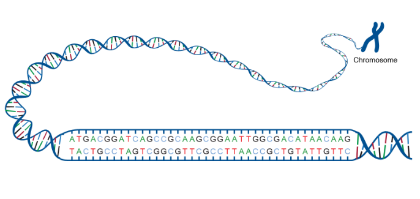

# Unwrapping-the-COVID-19-genome

- Here we will try to answering some of the questions of **bio-informatics** in regards to the recent panademic outbreak of **Corona virus(COVID-19)**, from a **non-medical background person's perspective**. 
Every analysis presented here is based on the stuff I learnt and understood (or felt that I actually understood) about **the genomes from the internet**.

## How to run?
- I have used **kaggle kernal** for running the code, you can use that or **jupyter notebook** or any editor like **pycharm or atom or visual studio code**.
- For kaggle just create new notbook and copy the given **Unwrapping the COVID-19 genome.ipynb** file and Add data there from links given in **dataset.md** file, then select **GPU** instaed of null in preference section for fast execuastion.

## Acknowledgement
I am very thankful to Allen Institute For AI for providing wonderful [dataset](https://www.kaggle.com/allen-institute-for-ai/CORD-19-research-challenge).

## Work-Flow of the python code.
- Basic Context
- Comparison of composition of genomes
  - Oligonucleotide composition
  - GC Content
- Proteins & Amino Acids
  - Protein Strands by genome 
  - Amino Acids Distribution
  - Finding the ORFs
  - Summary of Protein Sequences
- Sequence Alignment
- Pairwise Sequence Alignment
- Genome Sequence Similarity
- Generating a Phylogenetic Tree
- Clustering all COVID-19 patients' genomes
- Conclusions

## Basic Context

- First Question comes to our mind is **what is genome?**
  - [Genomes](https://en.wikipedia.org/wiki/Genome) are considered to be **genetic material of any organism**. It consists of **[DNA](https://en.wikipedia.org/wiki/DNA)(or [RNA](https://en.wikipedia.org/wiki/RNA))** which in turn can be considered as the **blueprints of any organism's origin.**
  - let's see how the genome look  like:
  
 

- How to **study Genomes?**
   
  - A genome consists of a **sequence of nucleotides** that together make up all the chromosomes of any organism. These nucleotides are the basic building blocks of DNA and RNA.
  - A DNA genome has 4 types of base nucleotides -
    - **Adenine** also represented as A,
    - **Thymine** represented as T,
    - **Guanine** represented as G and
    - **Cytosine** represented as C.
  
  - In RNA genome, the Thymine nucleotide is replaced with what is known as Uracil represented as U.
In short, **any genome sequence is basically a combination of all these [nucleotide](https://en.wikipedia.org/wiki/Nucleotide) in some order.**

- Obevise question comes to our mind is that **"Can one find a cure for COVID-19 by studying the genomes?"**

  - Not sure, as the molecular biology has not really been my field of study (never liked Biology) but also because its a very vast subject where to confirm on a single hypothesis also takes months/years of evaluation and testing. 

  - Having said that, the whole purpose of **this analysis is to help the ones who actually understand molecular biology get some data-driven insights** to be able to preapare **a RNA vaccine at the earliest**.
  

# Conclusions

- Based on the oligonucleotide compositions, all the genomes from coronaviridae family show similar composition (trinucleotide and tetranucleotide composition)
- Based on GC content, the composition of Hedgehog infected Corona virus is closely similar to COVID-19 genome's GC content.
- Judging by the number of protein strands, the count in COVID19's genome is very close to those found in Bat infected with SARS like corona virus.
- If you filter down some of the categories in the plotly-plot of distribution of amino acids, you'll see the percentage of amino acids in COVID-19's genome closely match to those of MERS, Civet infected with SARS like CoV, Camel with alpha CoV and Malaria except for some and low high contents among L (Leucine), P (Proline) and T (Threonine) amino acids.
- Checking by the generated Phylogenetic tree, the genomes of COVID-19 and malaria virus show the maximum similarity. Perhaps this also explains why there's a lot of buzz on the news and internet about trying [Hydroxycholorquine](https://en.wikipedia.org/wiki/Hydroxychloroquine) and [anti-retroviral drugs](https://www.deccanherald.com/city/top-bengaluru-stories/coronavirus-hiv-anti-retroviral-drugs-to-be-used-for-covid-19-treatment-814534.html) which happen to be the medicines for malaria and HIV viruses, respectively.
- Of all the genomes of COVID-19 infected patients avaialable on Kaggle, some patients show similar traits when clustered based on their genome sequence similarity.I really don't know how helpful this would be but if something works or had worked for a patient, then same should also work for patients in the same cluster.

**Image of hylogenetic Tree**

